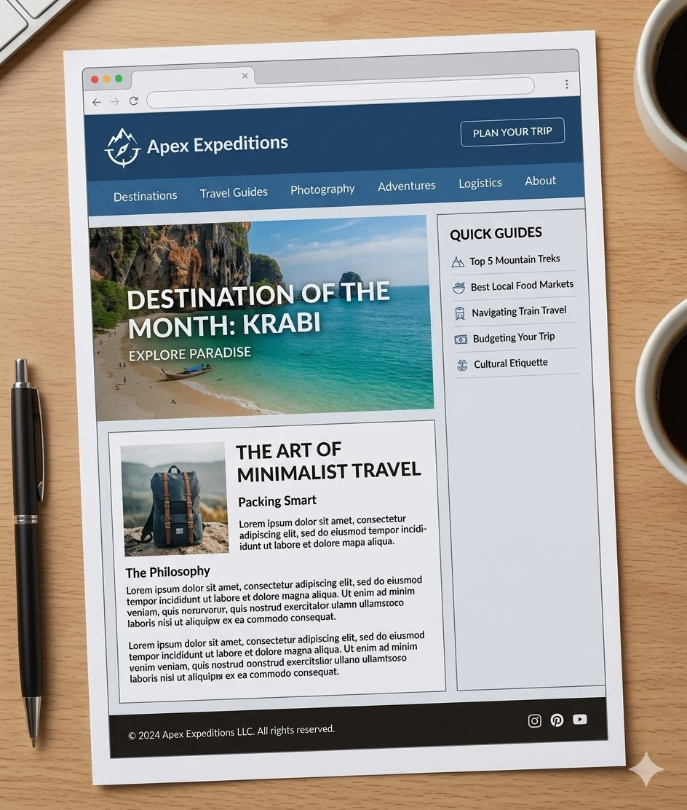

# 🛠️ Laboratório 1: O Esqueleto Semântico

O print de tela a seguir foi criado por inteligência artificial e refere-se a um website fictício de expedições turísticas. Com base exclusivamente nesta referência visual, você deverá realizar as 3 tarefas abaixo para estruturar a arquitetura da página.

### 📋 Tarefas

1.  **Tarefa 1:** Analisar o layout e desenhar no papel/ferramenta digital quais tags semânticas serão usadas em cada área.
2.  **Tarefa 2:** Codificar a estrutura no VS Code. Não é necessário CSS, apenas HTML bem estruturado.
3.  **Tarefa 3:** Validar o código no [W3C Validator](https://validator.w3.org/) para garantir que a hierarquia está correta.

---
*Desenvolvido durante a Pós-Graduação em Web da UTFPR.*
